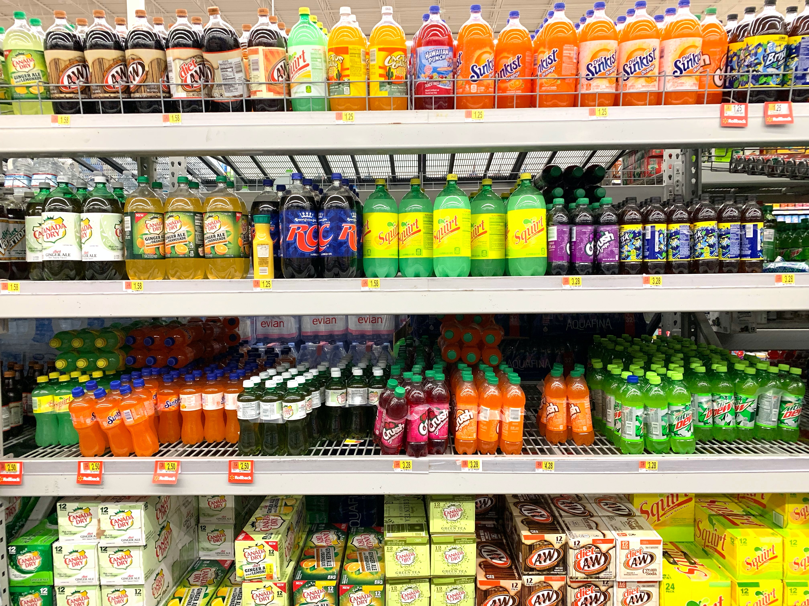

# StockWatch: Retail Shelf Stock-out Identification using Object Detection

* Out of stock is one of the major issues faced in many retail outlets and also a substantial loss concern in terms of the revenue. According to a study conducted by the IHL group, the total loss of sales due to out of stock amounts to over $1 trillion. 
* In this project, we addressed this issue by developing methods for detecting empty/semi-empty spots in shelves in real-life settings. 
* We collected a novel dataset to simulate real retail world that posses many challenges to be addressed and presenting scope for several approaches. Several variations of transfer learning and domain pre-training techniques are implemented using stateof-the-art object detection models. Ablation studies show extensive result comparison across different aspects of the model training and evaluation. 
* Based on our experiments, retail domain pre-training and fine-tuning, YOLOv5 and RetinaNet architectures, and layer freezing gave better results compared to others.
